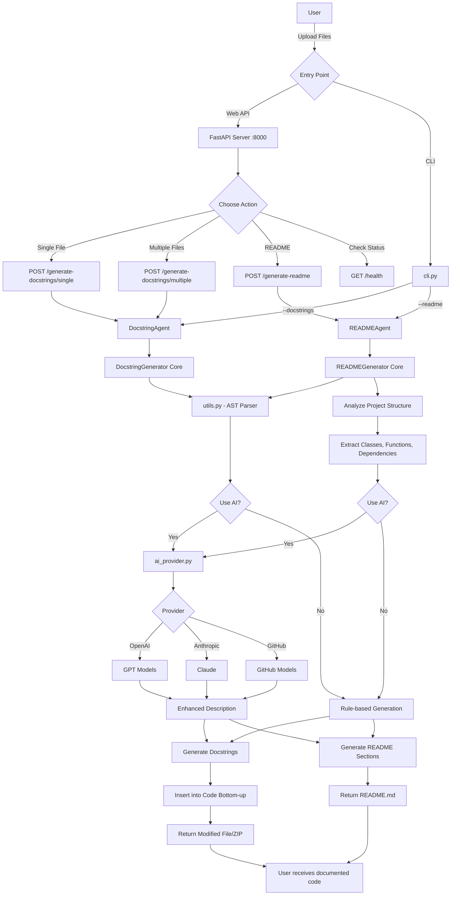

# Project Code Explanation (Medium Detail)

This project is a **documentation generator** for Python code. It can **add docstrings** to functions/classes and **produce a README** for a full project. The system exposes a web API (FastAPI) and reuses a core AST-based engine, with optional AI enhancement when API keys are present.

## 1) API Layer (FastAPI)

- `app/__main__.py`
  - **Purpose:** Defines the FastAPI app and all endpoints.
  - **Key endpoints:**
    - `POST /generate-docstrings/single` → upload one `.py` file and return the documented file.
    - `POST /generate-docstrings/multiple` → upload multiple `.py` files and return a ZIP.
    - `POST /generate-readme` → upload a ZIP of a project and return a generated `README.md`.
    - `GET /styles` and `GET /health` → status and supported docstring styles.
  - **Important detail:** Responses are created from in‑memory bytes (not temp files) to avoid file deletion issues.

- `app/agents.py`
  - **Purpose:** Thin wrapper layer that connects API routes to the core engines.
  - **How it helps:** Keeps the API clean and hides the internal generator details.

- `app/models.py`
  - **Purpose:** Pydantic response models for consistent JSON schema (health, styles).

- `app/config.py`
  - **Purpose:** Loads environment variables specific to the API (host, port, default AI usage).

## 2) Runtime Entry

- `src/main.py`
  - **Purpose:** Starts the FastAPI app with Uvicorn.
  - **Typical use:** `python3 src/main.py` to run the server locally.

## 3) Core Docstring Engine

- `docstring_generator.py`
  - **Purpose:** Main AST-based docstring insertion engine.
  - **How it works:**
    - Parses Python files into AST.
    - Finds functions, classes, and methods (including line numbers).
    - Builds docstrings in **Google / NumPy / Sphinx** formats.
    - Inserts docstrings **bottom‑up** so line numbers stay valid.
  - **Optional AI:** If enabled, calls the AI provider to refine descriptions.

## 4) README Generator

- `readme_generator.py`
  - **Purpose:** Generates a project README by analyzing all Python files.
  - **What it extracts:**
    - Files, classes, functions, imports, dependencies, and entry points.
    - A tree‑style project structure.
  - **Output:** A structured README with sections like usage, features, and limitations.

## 5) Utilities and Helpers

- `utils.py`
  - **Purpose:** Shared helpers for reading files, parsing AST, extracting function/class metadata, and scanning directories.

## 6) AI Providers and Global Config

- `ai_provider.py`
  - **Purpose:** Unified interface for AI providers (OpenAI, Anthropic, GitHub Models).
  - **How it’s used:** The core generators call this to enhance descriptions when enabled.

- `config.py`
  - **Purpose:** Central configuration for generator behavior (model names, tokens, temperature, keys, defaults).

---

## 7) System Flow Diagram

### How the Flow Works:

1. **Entry Points**: Users can access via Web API or CLI
2. **Request Processing**: API routes or CLI args determine the action
3. **Core Engine**: DocstringGenerator or READMEGenerator processes files
4. **AST Parsing**: Python code analyzed using Abstract Syntax Tree
5. **AI Enhancement**: Optional AI-powered description improvements
6. **Output Generation**: Modified files or README returned to user
