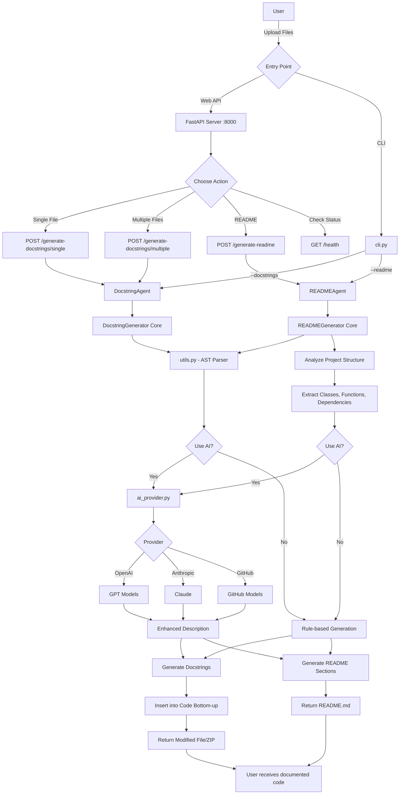

# Documentation Generator - EPOCH AI Agent

An AI-powered documentation generation tool for Python projects. Automatically generates PEP-257 compliant docstrings and comprehensive README files.

## Features

- 🚀 **FastAPI Web Interface** with Swagger UI
- 📝 **Automatic Docstring Generation** (Google, NumPy, Sphinx styles)
- 📖 **README Generation** from project analysis
- 🤖 **Optional AI Enhancement** with OpenAI/Anthropic
- 💻 **REST API** for easy integration
- 📦 **Batch Processing** for multiple files/projects

## Requirements

- Python 3.8+
- pip package manager
- Optional: OpenAI or Anthropic API key for AI enhancement

## Installation

### Step 1: Clone the repository

```bash
git clone https://github.com/kumarswamyg2005/Docstring-Generation-Agent-and-README-Generation-Agent.git
cd Docstring-Generation-Agent-and-README-Generation-Agent
```

### Step 2: Create virtual environment

```bash
python3 -m venv venv
source venv/bin/activate  # On Windows: venv\\Scripts\\activate
```

### Step 3: Install dependencies

```bash
pip install -r requirements.txt
```

### Step 4: Configure environment (Optional)

Create a `.env` file for AI enhancement:

```env
OPENAI_API_KEY=your_key_here
# OR
ANTHROPIC_API_KEY=your_key_here
```

## Usage

### Option 1: Run with Python

```bash
python src/main.py
```

Or with uvicorn directly:

```bash
uvicorn app.__main__:app --reload
```

### Option 2: Run with Docker

```bash
cd src
docker-compose -f docker.compose.yaml up --build
```

The API will be available at: **http://localhost:8000**

### Access Swagger UI

Open your browser and navigate to: **http://localhost:8000**

## API Endpoints

- `POST /generate-docstrings/single` - Generate docstrings for a single file
- `POST /generate-docstrings/multiple` - Generate docstrings for multiple files
- `POST /generate-readme` - Generate README from project ZIP
- `GET /styles` - Get available docstring styles
- `GET /health` - Health check

## Project Structure

```
├── src/
│   ├── main.py              # Application entry point
│   ├── dockerfile           # Docker configuration
│   └── docker.compose.yaml  # Docker Compose configuration
├── app/
│   ├── __main__.py          # FastAPI application
│   ├── agents.py            # Documentation agents
│   ├── config.py            # Configuration
│   └── models.py            # Pydantic models
├── docstring_generator.py   # Core docstring logic
├── readme_generator.py      # Core README logic
├── requirements.txt
└── README.md
```

## System Architecture & Flow

The following diagram illustrates how DocuMate processes requests through both Web API and CLI interfaces:



### How the Flow Works:

1. **Entry Points**: Users can access via Web API (http://localhost:8000) or CLI (`cli.py`)
2. **Request Processing**: API routes or CLI arguments determine the action
3. **Core Engine**: DocstringGenerator or READMEGenerator processes files
4. **AST Parsing**: Python code analyzed using Abstract Syntax Tree
5. **AI Enhancement**: Optional AI-powered description improvements via OpenAI/Anthropic/GitHub Models
6. **Output Generation**: Modified files or README returned to user

## Author

Kumar Swamy G - [GitHub](https://github.com/kumarswamyg2005)
